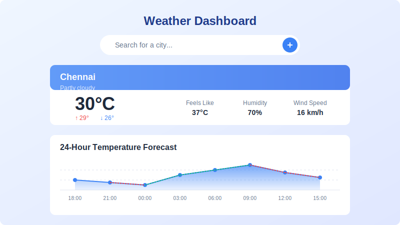
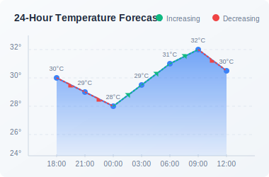
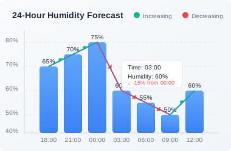

# 🌦️ WeatherVue

<div align="center">
  
  
  <h3>A beautiful, modern weather dashboard built with React, TypeScript, and D3.js</h3>

  <p>
    <a href="#features">Features</a> •
    <a href="https://weathercue.netlify.app/" target="_blank">Live Demo</a> •
    <a href="#screenshots">Screenshots</a> •
    <a href="#installation">Installation</a> •
    <a href="#usage">Usage</a> •
    <a href="#technologies">Technologies</a> •
    <a href="#api">API</a> •
    <a href="#license">License</a>
  </p>
</div>

## ✨ Features

- 📱 **Responsive Design** - Beautiful UI that works on all devices
- 🌡️ **Real-time Weather Data** - Current conditions with temperature, humidity, and wind speed
- 📊 **Interactive D3.js Charts** - Visualize temperature and humidity trends with smooth animations
- 🔍 **Location Search** - Search for weather in any city worldwide
- 📈 **Temperature Trends** - Visual indicators showing temperature changes over time
- 💧 **Humidity Analysis** - Track humidity changes throughout the day
- 🌙 **Forecast** - 24-hour weather forecast with detailed information
- 🔄 **Unit Conversion** - Toggle between Celsius and Fahrenheit
- 🌐 **No API Key Required** - Uses Open-Meteo's free weather API

## 🌐 Live Demo

Check out the live demo: [WeatherVue Demo](https://weathercue.netlify.app/)

## 📸 Screenshots

<div align="center">
  
  <p><em>Main dashboard showing current weather and forecast</em></p>
  
  <br>
  
  <div style="display: flex; justify-content: space-between;">
    <div style="flex: 1; padding: 0 10px;">
      
      <p><em>Temperature forecast with interactive D3.js visualization</em></p>
    </div>
    <div style="flex: 1; padding: 0 10px;">
      
      <p><em>Humidity forecast with interactive D3.js visualization</em></p>
    </div>
  </div>
</div>

## 🚀 Installation

```bash
# Clone the repository
git clone https://github.com/Ashish5689/WeatherVue.git

# Navigate to the project directory
cd WeatherVue

# Install dependencies
npm install

# Install D3.js and its types
npm install d3 @types/d3
```

> **Note**: If you encounter permission issues when installing D3.js, check the `D3_INSTALL_INSTRUCTIONS.md` file for alternative installation methods.

## 📋 Usage

```bash
# Start the development server
npm run dev

# Build for production
npm run build

# Preview the production build
npm run preview
```

## 🛠️ Technologies

- **Frontend Framework**: [React](https://reactjs.org/) with [TypeScript](https://www.typescriptlang.org/)
- **Build Tool**: [Vite](https://vitejs.dev/)
- **Styling**: [Tailwind CSS](https://tailwindcss.com/)
- **UI Components**: [shadcn/ui](https://ui.shadcn.com/)
- **Data Visualization**: [D3.js](https://d3js.org/)
- **Icons**: [Lucide React](https://lucide.dev/)
- **Weather Data**: [Open-Meteo API](https://open-meteo.com/)
- **Animation**: [Framer Motion](https://www.framer.com/motion/)

## 🌩️ API

WeatherVue uses the [Open-Meteo API](https://open-meteo.com/) to fetch weather data:

- **Free to use** - No API key required for non-commercial use
- **High Resolution** - Detailed weather data with global coverage
- **Accurate Forecasts** - Uses data from national weather services
- **Hourly Updates** - Weather models updated every hour
- **Historical Data** - Access to historical weather information

The implementation includes:

- Current weather conditions
- 24-hour hourly forecast
- Temperature and humidity charts
- Wind speed and "feels like" temperature

## 📊 Data Visualization Features

WeatherVue features advanced data visualization using D3.js:

- **Temperature Chart**:
  - Smooth gradient area fill
  - Curved lines for elegant visualization
  - Interactive tooltips showing precise temperature values
  - Time-based x-axis with hour labels
  - Properly scaled temperature values on y-axis
  - Responsive design that adapts to screen size
  
- **Humidity Chart**:
  - Beautiful blue gradient visualization
  - Interactive tooltips showing precise humidity percentages
  - Visual grid guides for better readability
  - Time-based x-axis aligned with temperature chart
  - Properly scaled 0-100% humidity values

Both charts feature:
- Automatic data point highlighting on hover
- Smooth animations and transitions
- Proper timezone handling
- Elegant visual styling that matches the UI
- Responsive sizing for all devices

## 🤝 Contributing

Contributions are welcome! Please feel free to submit a Pull Request.

1. Fork the repository
2. Create your feature branch (`git checkout -b feature/amazing-feature`)
3. Commit your changes (`git commit -m 'Add some amazing feature'`)
4. Push to the branch (`git push origin feature/amazing-feature`)
5. Open a Pull Request

## 📄 License

This project is licensed under the MIT License - see the [LICENSE](LICENSE) file for details.

---

<div align="center">
  <p>Made with ❤️ by Ashish jha</p>
  <p>
    <a href="https://github.com/Ashish5689/">GitHub</a> •
    <a href="https://www.linkedin.com/in/ashish-jha5689/">LinkedIn</a>
  </p>
</div>
